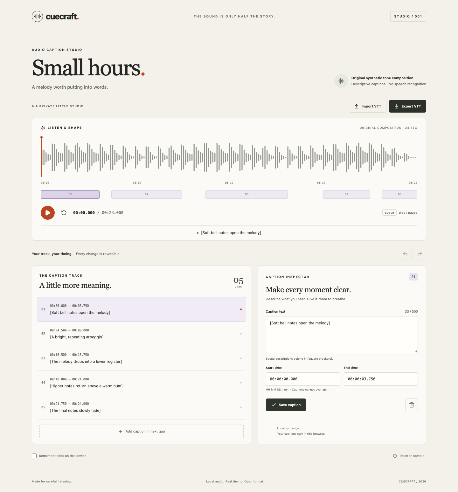

# Cuecraft

**A little studio for the part of sound you can read.**

Cuecraft is a polished, local audio-caption editor: listen to an original composition, shape its descriptive captions, and export an interoperable WebVTT file. The waveform is calculated from decoded audio samples and playback follows the actual browser media clock.



[View the mobile studio](docs/screenshots/mobile.png) · [Behavior specification](SPEC.md) · [Architecture walkthrough](docs/ARCHITECTURE.md) · [Engineering decisions](docs/DECISIONS.md)

**[Open the live demo](https://nen-io.github.io/cuecraft/)** · [CI checks](https://github.com/nen-io/cuecraft/actions)

## Try it locally

Node 24 and npm are required. No account, API key, backend, or external media service is needed.

```sh
npm ci
npm run dev
# Open http://127.0.0.1:4302
```

```sh
npm run typecheck     # TypeScript checks
npm test              # Domain invariant and codec tests
npm run build         # Checked production build in dist/
npm run check         # Typecheck, unit tests, production build
npx playwright install chromium
npm run test:e2e      # Real browser journeys and screenshots
npm run assets:generate # Reproduce the original PCM WAV asset
npm run format        # Format source, tests and documentation
npm run format:check  # Verify formatting without writes
```

## A short listening session

1. Press Play and listen to **Small hours**, an original 24-second synthetic tone composition. These are descriptive sound captions, not a speech transcription.
2. Click a caption in the track or timeline. Change its text and `HH:MM:SS.mmm` boundaries; save. Overlapping or invalid captions are rejected without changing the committed track.
3. Try Undo and Redo. Playback and selection do not consume history; edits, imports, deletion and reset do.
4. Export VTT. Import that file to round-trip captions, including Unicode and literal `<`, `>` and `&` characters.
5. Optionally enable **Remember edits on this device**. Turn it off to remove the saved copy, or export for portable backup.

## What is implemented

- Actual audio transport, click/keyboard seeking, active captions and a decoded waveform.
- Validated millisecond timing, a first-gap caption insertion rule and bounded immutable history.
- Strict WebVTT subset import, UTF-8 export, HTML-safe React text rendering and atomic file replacement.
- Stale import fencing so a slow file read cannot overwrite newer edits.
- Asset/version-bound optional storage, graceful storage failures, and media retry that preserves session edits.
- Responsive desktop/phone layout, visible keyboard focus and reduced-motion support.
- Production content security policy, bounded inputs and no analytics or third-party uploads.

## Intentional limits

This is a focused single-user static portfolio app. It edits one bundled audio asset; it does not upload audio, transcribe speech, collaborate across tabs, or render a captioned video. Documents allow 100 captions, 500 UTF-16 code units per caption and 40 undo states. Imports are limited to 512 KiB, which accommodates every valid 100-caption document even after maximum WebVTT escaping. See the [supported VTT subset](docs/ARCHITECTURE.md#webvtt-subset) and [scale boundaries](docs/SCALABILITY.md).

The audio, captions and interface are original to this example. The audio-generation script is included. [Asset provenance](docs/ASSETS.md) explains reproducibility and licenses.

## Engineering notes

- [Security model and residual risks](docs/SECURITY.md)
- [Implemented limits and scaling plan](docs/SCALABILITY.md)
- [Tests, evidence and verification limits](docs/TESTING.md)
- [Design plan](docs/DESIGN.md)
- [Architecture and source map](docs/ARCHITECTURE.md)

MIT licensed. This repository is an educational portfolio demonstration; deployment and browser/device verification evidence are recorded separately from local checks.
