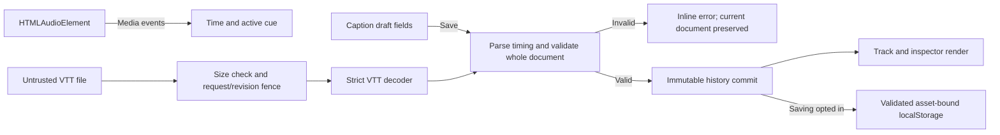

# How Cuecraft works

## Boundaries and module map

| Module                           | Responsibility                                                                                   |
| -------------------------------- | ------------------------------------------------------------------------------------------------ |
| `src/domain/captions.ts`         | External-state validation, model operations, timing, WebVTT codec, asset-bound persistence codec |
| `src/domain/history.ts`          | Pure bounded commit/undo/redo transitions                                                        |
| `src/domain/drafts.ts`           | Saved-field projection and explicit draft comparison                                             |
| `src/domain/waveform.ts`         | Peak aggregation from real decoded samples                                                       |
| `src/hooks/useMedia.ts`          | Audio element events, load/play errors, waveform decoding and cancellation                       |
| `src/components/Transport.tsx`   | Waveform, native range seek, timeline and active caption presentation                            |
| `src/components/CueEditor.tsx`   | Controlled draft fields, playhead actions, explicit save/discard and errors                      |
| `src/components/CaptionList.tsx` | Ordered selection and add action                                                                 |
| `src/App.tsx`                    | Document/history orchestration, selection, optional persistence, guarded import and download     |
| `scripts/generate-audio.mjs`     | Reproducible original tone composition                                                           |

The domain modules have no React or DOM dependencies. React owns presentation and the current history; the media element owns playback position. A cue's half-open interval `[startMs, endMs)` prevents two adjacent captions from being active at the same boundary.

## Concrete action: change a caption

The inspector keeps draft strings separate from committed state. Save parses both timestamps into integer milliseconds, constructs a candidate cue and calls `updateCue`. That function checks the existing identity and passes the entire candidate document through `validateDocument`. Sorting and overlap detection happen before any state changes. A failed validation throws an actionable error displayed beside the form; the track, playback and undo state stay unchanged.

On success the studio increments its revision and dispatches a single history commit. The reducer appends the previous document to the bounded past and clears redo. React redraws the track and active caption from the new document. If device saving is enabled, an effect serializes the committed document with the asset key. Storage denial/quota failure produces a visible notice; it never rolls back the in-memory edit. The studio owns a Map of drafts keyed by existing cue ID. Selection changes preserve each unfinished form; Save removes only that cue’s draft and Discard restores its committed values. Typing back to the exact saved fields removes the dirty state. Drafts never enter active captions, history, persistence or export. Import, undo, redo and sample reset are disabled while any draft exists, with a visible explanation. Deleting a dirty cue requires Save or Discard first; adding a cue leaves other drafts intact.

## Playback and waveform

The bundled PCM WAV is loaded by `HTMLAudioElement`. `loadedmetadata` supplies the actual media duration; editing waits for it. `timeupdate` and `seeked` mirror `currentTime`, with `play`, `pause`, `ended` and `error` controlling status. There is no simulated timer and no interval advancing the playhead. A seek writes `currentTime` and then reads back the media value. Set start/end to playhead reads the audio element’s currentTime at the click, rounds/clamps to the media bounds and changes only a draft field. Save still validates ordering and overlap. The UI is event-rate accurate, not sample-accurate animation. Browser autoplay/play rejection is visible.

A same-origin fetch independently decodes that same WAV using `AudioContext.decodeAudioData`. Its mono samples are reduced into 180 maximum-amplitude bins. The temporary audio context closes after decoding; abort and liveness guards prevent stale completion after unmount. A waveform decode failure does not invent replacement bars. Media retry retains the first known duration and the mounted studio, preserving edits and undo history.

## WebVTT subset

Exports use `WEBVTT`, numeric cue identifiers, `HH:MM:SS.mmm --> HH:MM:SS.mmm`, and text. Text escapes `&`, `<`, `>` and uses numeric character references for LF/CR, preserving multiline or blank-line text within one physical cue line. Both the local round-trip codec and Chromium's native `VTTCue.getCueAsHTML()` are tested, including Unicode and significant whitespace. Other browser engines have not been verified.

Imports accept optional BOM, LF/CRLF files, optional numeric IDs, exact timestamps and plain/escaped text. A final line ending is a delimiter; text's spaces are preserved. Settings, regions, NOTE/STYLE blocks, arbitrary tags, unsupported entities, non-numeric IDs and nonconforming timestamps are intentionally rejected. Whole documents are validated against the loaded media. Import does not merge: it is one undoable replacement.

File size is checked before `File.text()` and again by UTF-8 byte count in the codec. A request counter rejects stale reads; a session revision check rejects any read started before later draft typing, discard, committed edit, undo or reset. Import also refuses to begin while any draft exists, including one on an unselected cue. Failed/corrupt/oversize imports preserve the existing document.

## Focus and navigation

At 700px and below, explicitly selecting a cue focuses the inspector heading and scrolls it into view. Back to captions focuses the track heading. Desktop selection keeps the side-by-side context. Navigation occurs after React commits the selected form; playback ticks do not trigger scrolling.

## Storage and exports

Saving is opt-in and includes committed captions only. Unsaved per-cue drafts are session-only and disappear on reload; the inspector and export notice make this distinction explicit. A validated saved document restores automatically on a future visit. Storage key `cuecraft:small-hours-pcm-v1` and an embedded asset identity guard against unrelated media, with an explicit schema version and exact actual-duration match. Malformed or oversized saved state is ignored with a notice. Cross-tab synchronization is intentionally absent: another tab can overwrite the same saved slot. Turning saving off attempts removal. Export is a client-generated `Blob` URL revoked after the download is initiated; imported text is never sent to a server.

## Official sources consulted

Consulted 17 September 2026; installed versions are pinned in `package.json` and `package-lock.json`.

- [React useReducer](https://react.dev/reference/react/useReducer): pure reducer transitions for immutable history.
- [React useRef](https://react.dev/reference/react/useRef): media DOM ownership and current async request/revision counters.
- [MDN HTMLMediaElement](https://developer.mozilla.org/en-US/docs/Web/API/HTMLMediaElement): time, duration and media state authority.
- [MDN timeupdate](https://developer.mozilla.org/en-US/docs/Web/API/HTMLMediaElement/timeupdate_event): event frequency is browser/load dependent.
- [MDN decodeAudioData](https://developer.mozilla.org/en-US/docs/Web/API/BaseAudioContext/decodeAudioData): decoded sample access for a truthful waveform.
- [Vite static deployment](https://vite.dev/guide/static-deploy): relative asset base for repository subpaths.

Refinement references rechecked on 17 September 2026: [React state preservation](https://react.dev/learn/preserving-and-resetting-state), [native currentTime](https://developer.mozilla.org/en-US/docs/Web/API/HTMLMediaElement/currentTime), and [Playwright retrying assertions](https://playwright.dev/docs/test-assertions). No dependency versions changed.
