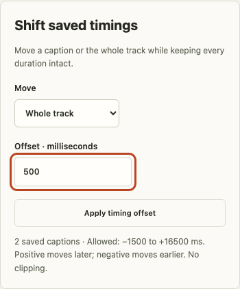

# A three-minute engineering review

Cuecraft is a recent AI-assisted portfolio demonstration of media editing and careful local state. The bundled 24-second tone composition is original and synthetic; the app does not transcribe speech or upload audio.

## Try one complete edit

Open the [public studio](https://nen-io.github.io/cuecraft/). Press Play, then pause: the clock and decoded waveform come from the actual audio element. Select caption 1 and use **Shift saved timings** with the default selected scope and **250** milliseconds. Its boundaries move from 0–3.75 seconds to 0.25–4 seconds. Undo restores both times in one step; Redo restores the correction.

Type an unfinished caption, select another cue and return. The draft stays with its cue; timing shifts, import and history are protected until every draft is saved or discarded. Export includes saved captions only. A **Whole track** offset preserves all durations and gaps; the sample touches both audio boundaries so it correctly has no room to move until its boundary cues are shortened. Imported tracks with head/tail room can shift together.

## Read the evidence

- [Offset rules](../src/domain/offset.ts) compute bounds from adjacent cues and audio limits, then validate the entire new document. They never clip individual captions.
- [Offset unit cases](../tests/unit/offset.test.ts) cover positive/negative inclusive limits, collisions, malformed inputs, empty tracks and immutability.
- [Browser offset journeys](../tests/e2e/offset.spec.ts) exercise history, draft gating, exact downloaded WebVTT timestamps and keyboard/mobile links.
- [Core browser journeys](../tests/e2e/studio.spec.ts) cover the real media clock, file/import races, retention, storage and native Chromium WebVTT decoding.
- [Architecture](ARCHITECTURE.md), [decisions](DECISIONS.md), [security](SECURITY.md) and [testing](TESTING.md) explain the boundaries.

Use Node 24: `npm ci`, `npm run check`, `npx playwright install chromium`, `npm run test:e2e`.

## Boundary to discuss

This is one bundled audio track with at most 100 cues and 40 history states. Drafts last for this session; optional device storage stores saved captions in plaintext. The automated suite proves browser decoding and clock progression, not physical speaker output, cross-browser compatibility or a collaborative editing service.

